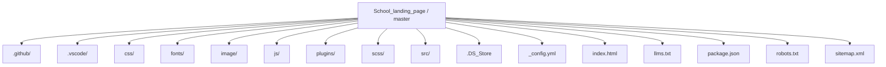
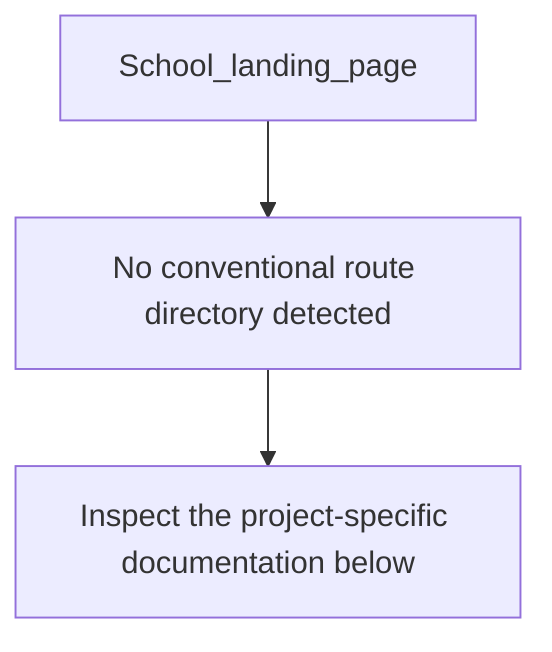
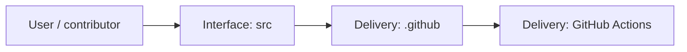
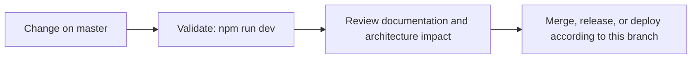

<div align="center">

# 🎓 School Landing Page

<!-- interactive-readme-standard:start -->

> [!NOTE]
> **Branch-specific documentation:** this section is maintained for [`master`](https://github.com/Nischhalsubba/School_landing_page/tree/master). It is generated from the files present on this branch and preserves the project-authored README below.

<details open>
<summary><strong>Interactive repository guide</strong></summary>

## Branch overview

| Item | Value |
|---|---|
| Repository | [`Nischhalsubba/School_landing_page`](https://github.com/Nischhalsubba/School_landing_page) |
| Branch | [`master`](https://github.com/Nischhalsubba/School_landing_page/tree/master) |
| Detected stack | CSS, JavaScript, Sass, HTML |
| Detected manifests | package.json |
| Documentation policy | Every maintained branch must explain purpose, setup, structure, architecture, flows, testing, delivery, security, and ownership. |

## Repository structure



The diagram is generated from the branch's actual top-level files and directories. Use the branch link above for complete source navigation.

## Website or application structure



## Application and responsibility flow



## Change-to-delivery flow



## README requirements for this branch

- Explain what this branch contains and how it differs from the default branch.
- Keep installation, configuration, usage, testing, deployment, security, support, and license information accurate.
- Document repository, website or application, API, data, authentication, background-job, and deployment flows when they exist.
- Prefer Mermaid diagrams and expandable `<details>` sections for visual navigation.
- Link diagrams and modules to real source paths; never invent missing components.
- Preserve project-specific documentation and update diagrams whenever architecture or major paths change.
- Treat secrets, private infrastructure, customer data, and credentials as prohibited README content.

</details>

<!-- interactive-readme-standard:end -->

### Static Education / Course Landing Page

**A responsive school and course landing page built with HTML, CSS, Bootstrap 4, jQuery, MeanMenu, Slick Slider, Fancybox, AOS animation, icon fonts, accordion sections, testimonial video cards, FAQ blocks, and newsletter CTA.**


</div>

---

## ✨ Overview

**School_landing_page** is a static education landing page designed for a school, course, or learning platform. It includes a hero section, course navigation, facts/statistics cards, course accordion, principal/author section, testimonial slider, FAQ accordion, newsletter signup, and footer navigation.

The site uses a classic static frontend stack with Bootstrap 4, jQuery plugins, AOS scroll animations, Slick slider, Fancybox video modal, MeanMenu mobile navigation, and custom minified CSS.

---

## 🧭 Table of Contents

- [Project Purpose](#-project-purpose)
- [Designer’s Perspective](#-designers-perspective)
- [Page Sections](#-page-sections)
- [Features](#-features)
- [Tech Stack](#-tech-stack)
- [Repository Structure](#-repository-structure)
- [Run Locally](#-run-locally)
- [Deployment](#-deployment)
- [Quality Checklist](#-quality-checklist)
- [Improvement Roadmap](#-improvement-roadmap)

---

## 🎯 Project Purpose

The purpose of this repo is to present a polished static landing page for education-related content.

It can be adapted for:

- schools
- online courses
- coaching institutes
- training programs
- education startups
- course marketing pages

---

## 🎨 Designer’s Perspective

This page follows a strong landing-page pattern: hero → proof → curriculum → instructor/principal → testimonial → FAQ → final CTA.

That structure works well for education because visitors usually need to know:

- what the learning offer is
- why it is credible
- what they will learn
- who is behind it
- what students say
- how to get started

The current UI already has a friendly visual tone with soft illustration-style assets, rounded cards, orange CTA styling, and animated decorative shapes.

---

## 🧱 Page Sections

| Section | Purpose |
|---|---|
| Header / Navigation | Logo, dropdown course menu, sign-in link, mobile menu |
| Hero | Main promise, CTA, rating, video trigger, hero illustration |
| Facts | Student count, lectures, reviews, questions solved |
| Course Accordion | Expandable “what you’ll learn” curriculum blocks |
| Principal / Author | Human introduction and trust-building section |
| Testimonials | Student testimonial video cards in a Slick slider |
| FAQ | Expandable common questions |
| Footer CTA | “Ready to be part of our school?” conversion prompt |
| Footer | Navigation, school contact info, newsletter signup |

---

## 🌟 Features

| Feature | Description |
|---|---|
| Responsive header | Desktop navigation and mobile MeanMenu support |
| Course dropdown | Multi-item dropdown under Courses |
| Hero video trigger | Fancybox video modal linked to YouTube |
| Rating display | Star rating and trust text |
| Facts cards | Animated statistic cards |
| Course accordion | Bootstrap collapse for curriculum details |
| AOS animation | Scroll-triggered entrance effects |
| Testimonial slider | Slick carousel for video testimonial cards |
| FAQ accordion | Expandable question/answer blocks |
| Newsletter form UI | Email input and submit icon in footer |

---

## 🛠 Tech Stack

| Layer | Technology | Purpose |
|---|---|---|
| Markup | HTML5 | Static page structure |
| CSS Framework | Bootstrap `4.3.1` | Responsive grid and components |
| Styling | `css/style.min.css` | Custom minified theme styles |
| JavaScript | jQuery | Plugin dependency and interactions |
| Mobile Menu | MeanMenu | Responsive menu behavior |
| Slider | Slick `1.8.1` | Testimonial carousel |
| Modal/Video | Fancybox | Video lightbox behavior |
| Animation | AOS | Scroll reveal effects |
| Icons | Font Awesome + EP icon fonts | Interface icons |

---

## 📁 Repository Structure

```text
.
├── index.html
├── css/
│   └── style.min.css
├── image/
│   ├── hero.png
│   ├── main-logo.png
│   ├── fact icons
│   ├── testimonial images
│   └── decorative shapes
├── js/
│   └── active.js
├── plugins/
│   ├── bootstrap-4.3.1/
│   ├── jquery/
│   ├── meanmenu/
│   ├── slick-1.8.1/
│   ├── fancybox-master/
│   └── aos-animation/
├── fonts/
│   ├── ep-icon-fonts/
│   └── fontawesome-5/
└── README.md
```

---

## 🚀 Run Locally

No build step is required.

Open `index.html` directly in your browser or run a static server:

```bash
python -m http.server 8000
```

Then open:

```text
http://127.0.0.1:8000/
```

---

## 🌐 Deployment

This site can be deployed to any static host:

- GitHub Pages
- Netlify
- Vercel
- Cloudflare Pages
- shared hosting / cPanel

Keep the `plugins/`, `css/`, `js/`, `fonts/`, and `image/` folder structure intact.

---

## ✅ Quality Checklist

### Design QA

- [ ] Hero copy clearly explains the school/course offer.
- [ ] CTA buttons are visible and consistent.
- [ ] Course accordion is easy to scan.
- [ ] Testimonial cards align properly.
- [ ] FAQ spacing is readable.
- [ ] Mobile menu works cleanly.
- [ ] Footer CTA stands out.

### Technical QA

- [ ] Bootstrap CSS/JS loads.
- [ ] jQuery loads before plugins.
- [ ] MeanMenu works on mobile.
- [ ] Slick slider works.
- [ ] Fancybox video opens.
- [ ] AOS animations initialize.
- [ ] No broken image paths.
- [ ] No console errors appear.

### Content QA

- [ ] Replace placeholder principal text.
- [ ] Replace placeholder student names.
- [ ] Replace generic FAQ copy.
- [ ] Update real school contact details.
- [ ] Fix typos like “Trused” → “Trusted”.
- [ ] Replace demo YouTube video with official video.

---

## 🗺 Improvement Roadmap

- Add SEO title and meta description.
- Add Open Graph preview image.
- Add real school/course content.
- Improve accessibility labels for accordions and forms.
- Optimize image assets.
- Add real newsletter integration.
- Add course detail pages.
- Add contact/admission form.
- Improve mobile typography and spacing.

---

<div align="center">

A static education landing page built for clear course storytelling and student conversion.

</div>
