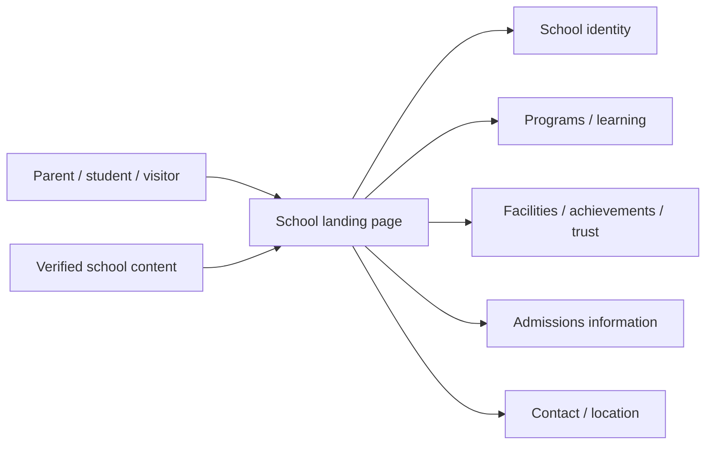
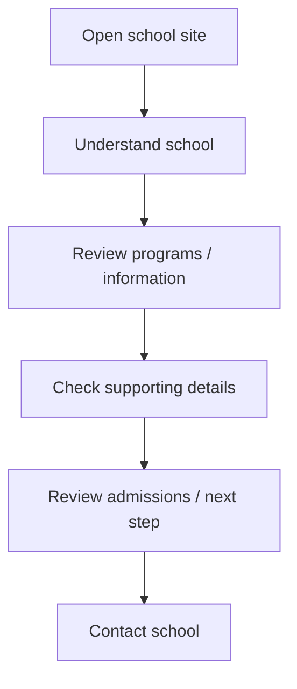
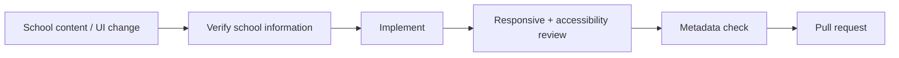

<div align="center">

# School Landing Page

**A responsive school landing-page project for presenting school identity, programs, admissions information, trust signals, and contact paths clearly.**


[Browse source](https://github.com/Nischhalsubba/School_landing_page/tree/master) · [Issues](https://github.com/Nischhalsubba/School_landing_page/issues)

</div>

## Overview

**School Landing Page** is documented around a parent/student journey: understand the school, review relevant programs or information, build confidence, and find an admissions/contact next step without hunting through a labyrinth of institutional prose.

<details open>
<summary><strong>🏗️ Interactive website architecture</strong></summary>



</details>

## Visitor flow



## Audience guide

| Audience | Focus |
|---|---|
| Parents / students | Programs, admissions, location and contact |
| Developers | Structure, interactions, assets and delivery |
| Designers | Trust, hierarchy, mobile behavior and accessibility |
| School staff | Accurate dates, programs, contacts, fees and claims |

## Getting started

```bash
git clone https://github.com/Nischhalsubba/School_landing_page.git
cd School_landing_page
```

Use the repository's project files to determine current development commands.

## Design & accessibility

Use readable typography, clear admissions CTAs, keyboard-visible focus, accessible navigation, meaningful image alternatives, responsive layouts and simple information hierarchy. Do not hide essential school information inside image-only content.

## SEO & discoverability

Public pages should use accurate terms such as **school, education, admissions, programs, classes, school location, school contact, and student learning** together with the real school name/location when known. Maintain unique titles/descriptions, semantic headings, Organization/School structured data, canonical URLs, sitemap/robots support and social metadata.

## Contribution flow


